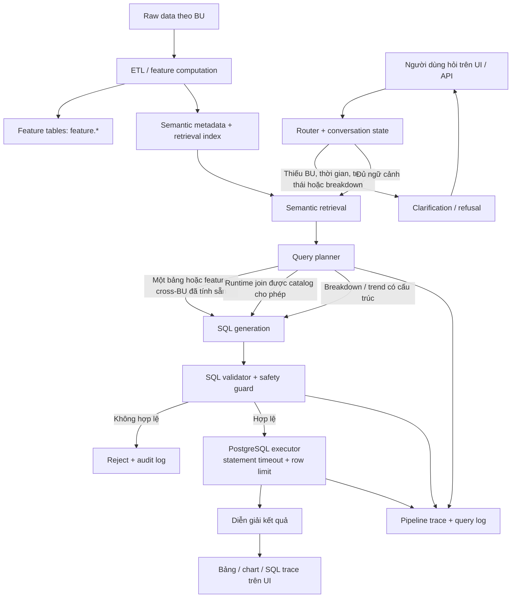

# Feature Store Query Agent

## Agent workflow



Nguyên tắc: agent chỉ truy vấn feature tables đã đăng ký trong semantic metadata.
Raw data, PII, DML, join không có catalog và SQL không qua validator đều bị chặn.

### How a request is handled

1. **Prepare data.** ETL converts BU-specific raw data into versioned feature
   tables; semantic metadata describes each feature, allowed dimension, and join.
2. **Understand the request.** The router extracts metrics, BU, time window,
   status, and requested breakdown. Conversation state asks for missing choices.
3. **Plan safely.** Retrieval selects matching features, then the planner picks a
   single table, a precomputed Cross-BU feature, or an approved runtime join.
4. **Generate and validate SQL.** SQL is constrained by the plan and rejected
   unless it is read-only, uses approved tables/features, and satisfies join,
   row-limit, and timeout policies.
5. **Return an auditable result.** PostgreSQL executes valid SQL only; the UI
   renders a table or suitable chart, while the pipeline trace records context,
   SQL, validation, and execution details.

Raw tables and PII are never queried by the agent. When metadata is missing or
the question is ambiguous, it clarifies or refuses rather than guessing.

Sprint 1 là agent hỏi dữ liệu GSM/VinFast bằng tiếng Việt. Agent chỉ đọc feature
tables, luôn hiển thị SQL, có row limit, timeout và guard AST cho raw/PII/DML.

## Local setup

Prerequisites: Docker Desktop, Python 3.11+, Node.js 20+.

```powershell
docker compose up -d db
Copy-Item backend\.env.example backend\.env
cd backend
.venv\Scripts\python.exe -m pip install -r requirements.txt
```

Bootstrap bằng database admin (mặc định trong `.env.example` là `postgres`):

```powershell
.venv\Scripts\alembic.exe upgrade head
.venv\Scripts\python.exe -m scripts.generate_semantic_layer
.venv\Scripts\python.exe -m scripts.generate_mock_data
.venv\Scripts\python.exe -m scripts.seed_golden_set
```

`generate_mock_data` xóa và nạp lại dữ liệu mock trong `raw` và `feature`.

## Runtime role

Tạo/đăng nhập bằng database admin, sau đó thay `<app_user>` bằng username trong
`DATABASE_URL` (ví dụ `agent`):

```sql
GRANT feature_agent_reader TO <app_user>;
GRANT feature_agent_logger TO <app_user>;
GRANT USAGE ON SCHEMA eval TO <app_user>;
GRANT SELECT, INSERT, UPDATE, DELETE ON ALL TABLES IN SCHEMA eval TO <app_user>;
GRANT USAGE, SELECT ON ALL SEQUENCES IN SCHEMA eval TO <app_user>;
```

Runtime query sẽ dùng `SET LOCAL ROLE feature_agent_reader`; vì vậy thiếu role
membership sẽ làm query fail an toàn thay vì chạy với quyền rộng.

## Verify and run

```powershell
cd backend
.venv\Scripts\python.exe -m pytest -q
.venv\Scripts\python.exe -m scripts.run_eval --tag sprint1-dev --split dev
uvicorn app.main:app --reload

cd ..\frontend
npm.cmd run test
npm.cmd run build
npm.cmd run dev
```

Chỉ chạy `--split holdout` một lần sau khi dev đạt target. Xem
[`docs/sprint1_runbook.md`](docs/sprint1_runbook.md) để đóng release.
