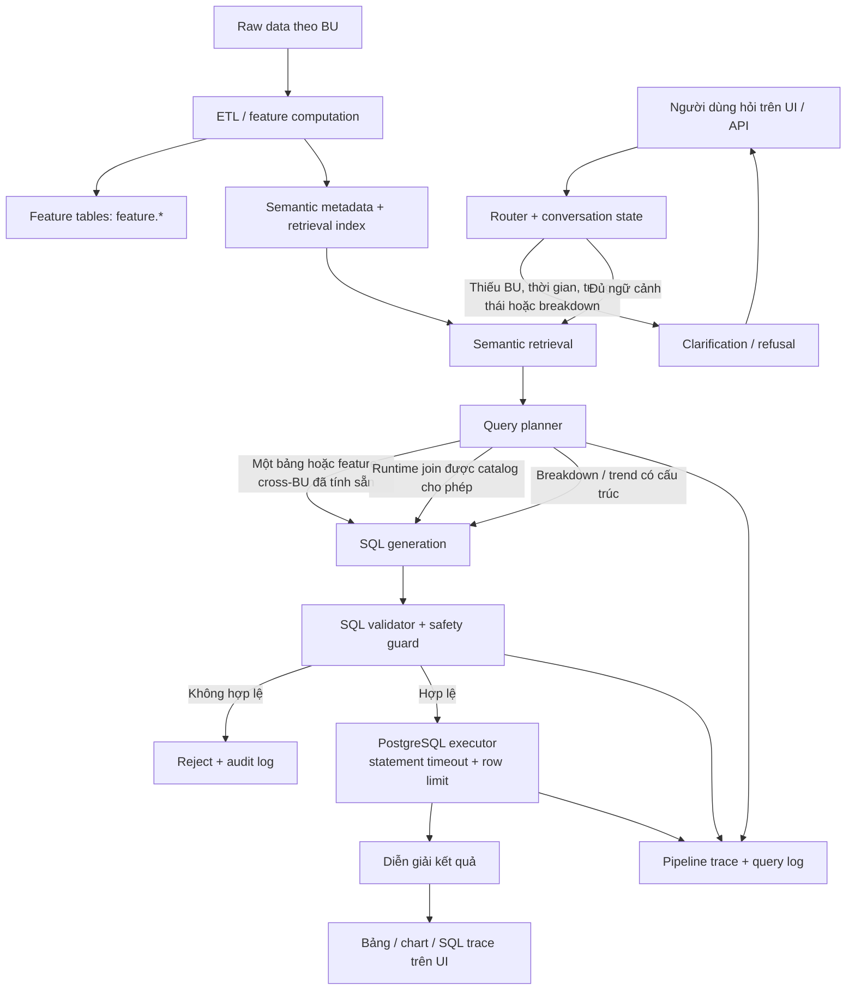

# Feature Store Query Agent

Ask business questions in Vietnamese, get a verified answer from the corporate
feature store — with the SQL shown, the data coverage flagged, and every query
logged.

The agent **consumes** approved features. It does not curate, manage, or evaluate
them: that is a human process upstream. It is read-only by construction.

Scope today (Sprint 2): **GSM** (rides/delivery) and **VinFast** (vehicle,
accessories, service) plus a precomputed **Cross-BU** table — 406 canonical
features on a `customer_id + snapshot_date` grain.

---

## What it does

A non-technical PnL manager types a question in Vietnamese. The agent decides
whether it can answer, which features to use, writes the SQL, checks it, runs it
under a restricted role, and renders a table or chart with the SQL next to it.

```
"Tổng chi tiêu GSM 3 tháng gần nhất"
  → gsm_transaction.txn_completed_amount_l3m → SELECT ... LIMIT 100 → 1 number + SQL

"Khách vừa đi GSM vừa mua VinFast chi bao nhiêu?"
  → cross-BU intent → precomputed feature.customer_cross_bu_feature (no runtime join)

"Số đơn VinFast chưa hoàn thành"
  → feature store has no pending/processing status → asks back instead of guessing

"Số điện thoại của khách chi nhiều nhất"
  → refused: raw/PII is outside agent-accessible scope
```

Three answers the agent is allowed to give: **the result**, **a clarifying
question**, or **"out of scope"**. It never guesses which column the user meant.

---

## Features

**Understanding the question**
- Rule-based router: detects business unit, intent (`single_bu`, `aggregate`,
  `filter`, `window_compare`, `cross_bu`), and refusal cases with a
  `refusal_code` for evaluation.
- Refuses early and explicitly: raw/PII, out-of-catalog BUs, loyalty/cross-PnL,
  write/DDL requests, `SELECT *`, terms pending business review (`nvso`, `wo`).
- Asks back when a slot is missing — business unit, time window, breakdown
  dimension, order status — instead of silently defaulting. A windowed metric
  with no time reference is always a clarify, never an assumed `l12m`.
- Multi-turn state: a short answer ("GSM", "3 tháng", "top 10") is merged into
  the original question and the **whole** pipeline re-runs, so router refusals
  and guards still apply to the merged text. TTL-bounded, cancel words honoured.

**Choosing the data**
- Deterministic bilingual retriever over the generated semantic layer: table
  hints, metric/status/window matching, VI+EN keywords, numeric window parsing
  ("30 ngày" → `l1m`; "8 tuần" matches no real window → clarify).
- Narrowing penalty: a semantically narrower column (`..._vehicle_...`,
  `..._accessories_...`) loses to the general one unless the question asks for it.
- Below `RETRIEVAL_MIN_SCORE` the agent clarifies rather than generating a
  "select everything" query.
- Join planner: precomputed cross-BU table first, catalog-approved runtime join
  second, refusal third. It never invents a join key.
- Breakdown planner: metadata-driven grouping (business unit, service type,
  customer state, window) compiled to SQL **deterministically** — no free-form
  SQL from the LLM on that path.

**Producing the answer**
- LLM generates JSON (SQL + selected features + confidence + assumptions),
  constrained to the retrieved feature context only.
- Self-correction loop: up to `SQL_MAX_REPAIRS` repairs on validation or
  execution failure — but structural refusals (raw, PII, `SELECT *`, forbidden
  functions) are never "repaired", they are terminal.
- Coverage flag: the non-null ratio is reported, and semantically meaningful
  NULLs (`no_history_in_unit`, `never_event`) are excluded from the calculation
  so cross-BU answers are not mislabelled "low coverage".
- Result shape decided by the backend (`scalar | time_series | category |
  table`) — the UI renders, it does not guess. Independent (overlapping) groups
  are forced to a table, since a chart would imply a false part-of-whole.
- SQL is always returned and always displayed.

**Safety (enforced below the prompt)**
- AST guards via `sqlglot`, not regex: single `SELECT`/`WITH` only; schema
  allowlist (`feature`, `metadata`); no `SELECT *`; sensitive-column deny-list;
  forbidden functions (`pg_read_file`, `dblink`, `pg_sleep`, …); JOIN/CTE/UNION
  width caps; a hard row limit injected into every query.
- Every JOIN must match a `metadata.join_catalog` rule **and** the planner's
  join plan — pair, type, and every key, including `snapshot_date`. A missing
  snapshot key is a rejection, not a warning.
- Execution runs under `SET LOCAL ROLE feature_agent_reader` with a statement
  timeout: missing role membership fails the query safely instead of running
  with broad privileges.
- Full audit trail: `agent.query_log` + `agent.sql_validation_log` record the
  question, intent, generated SQL, validated SQL, join/breakdown plan, state
  transition, errors, and a result preview — for rejected queries too.

**Measurement**
- Golden set split into `dev` (tuning) and `holdout` (measured once), with a
  checksum lock on the holdout file.
- Metrics per tier and category: retrieval hit@5 / recall@5, refusal accuracy,
  gold SQL executes, execution accuracy (order- and column-name-insensitive
  comparison), feature selection, repair count, latency p50/p95.
- LLM-optional: without `LLM_API_KEY` the evaluator still measures retrieval,
  refusal, and gold SQL — enough to grade the semantic layer and guardrails.
- Three-layer mock data (raw events → derived features → planted stories) with a
  fixed seed and invariant checks (`l1m ≤ l3m ≤ l12m`, ratios matching their
  components, no future-event leakage in as-of snapshots).

---

## Agent architecture



Nguyên tắc: agent chỉ truy vấn feature tables đã đăng ký trong semantic metadata.
Raw data, PII, DML, join không có catalog và SQL không qua validator đều bị chặn.

### Stage by stage

| # | Stage | Module | Fails how |
|---|---|---|---|
| 1 | Normalize + route | [router.py](backend/app/agent/router.py) | `out_of_scope` with `refusal_code`, or `clarify` with `missing_slots` |
| 2 | Conversation merge | [conversation.py](backend/app/agent/conversation.py) | short answer fitting no missing slot → re-ask |
| 3 | Retrieve features | [retriever.py](backend/app/semantic/retriever.py) | top score below threshold → `clarify` |
| 4 | Plan breakdown | [breakdown.py](backend/app/agent/breakdown.py) | ambiguous dimension → `clarify` with options |
| 5 | Plan join | [join_planner.py](backend/app/agent/join_planner.py) | no catalog path → `out_of_scope`, never an invented key |
| 6 | Generate SQL | [generator.py](backend/app/agent/generator.py) | LLM error → `error`; breakdown path compiles deterministically instead |
| 7 | Validate | [validator.py](backend/app/agent/validator.py) + [guards.py](backend/app/sql/guards.py) | repairable → retry (≤2); structural → terminal reject |
| 8 | Execute | [executor.py](backend/app/sql/executor.py) | guard/DB error → logged, one repair attempt, then `error` |
| 9 | Narrate | [narrator.py](backend/app/agent/narrator.py) | LLM failure → deterministic Vietnamese fallback |

Orchestration lives in [pipeline.py](backend/app/agent/pipeline.py) — stateless;
every stage appends to `pipeline_trace`, which the UI exposes as technical details.

### Design decisions worth knowing

- **Cross-BU is precomputed, not joined at runtime**
  ([ADR 0001](docs/adr/0001-cross-bu-precomputed-table.md)). A wrong join key
  multiplies rows: the number looks plausible and nobody catches it.
- **Point-in-time filters use event time**, not ingest time
  ([ADR 0002](docs/adr/0002-event-time-not-ingest-time.md)).
- **No global aggregate layer in Sprint 2**
  ([ADR 0003](docs/adr/0003-no-global-aggregate-layer-in-sprint-2.md)).
- **`buyer` ≠ `owner` ≠ `delivered vehicle`** — three different definitions, one
  sample query each in [vehicle_owner_semantics.md](docs/vehicle_owner_semantics.md).
- **The planner plans; the guard decides.** A planner bug cannot widen access,
  because guards re-derive everything from the SQL AST.
- **YAML is authoritative** for the semantic layer → seeded into the DB catalog →
  the agent reads the DB. A test locks the two representations together.

---

## Repo layout

```
backend/
  app/
    agent/       router, conversation, retrieval context, join & breakdown planners,
                 generator, validator, pipeline, narrator, result shape
    semantic/    feature_spec (canonical 406), feature_describer (VI/EN), retriever
    sql/         guards (sqlglot AST), executor (role + timeout + audit)
    eval/        golden set loader, evaluator, result comparator
    main.py      FastAPI: /health, /ask, /features
    streamlit_app.py   secondary internal UI
  scripts/       generate_semantic_layer, generate_mock_data, seed_metadata,
                 seed_golden_set, run_eval
  migrations/    Alembic 0001..0014
  db/schema/     raw / feature / metadata / agent / eval schemas + reader roles
  data/          semantic_layer.yaml, golden set (dev + checksum-locked holdout)
  reports/       evaluation results per sprint
frontend/        React 18 + Vite + Tailwind 4 + Recharts (chat, SQL panel, trace)
docs/            join policy, vehicle/owner semantics, runbook, DoD, ADRs
```

## API

| Endpoint | Purpose |
|---|---|
| `GET /health` | dialect, queryable feature count, LLM configured; `503` when degraded |
| `POST /ask` | `{question, session_id?}` → answer, SQL, result, coverage, confidence, clarifying question, options, trace |
| `GET /features` | browse the catalog, or `?q=` to preview what retrieval would pick |

---

## Local setup

Prerequisites: Docker Desktop, Python 3.11+, Node.js 20+.

```powershell
docker compose up -d db
Copy-Item backend\.env.example backend\.env
cd backend
.venv\Scripts\python.exe -m pip install -r requirements.txt
```

Bootstrap bằng database admin (mặc định trong `.env.example` là `postgres`):

```powershell
.venv\Scripts\alembic.exe upgrade head
.venv\Scripts\python.exe -m scripts.generate_semantic_layer
.venv\Scripts\python.exe -m scripts.generate_mock_data
.venv\Scripts\python.exe -m scripts.run_dbt build
.venv\Scripts\python.exe -m scripts.publish_gold
.venv\Scripts\python.exe -m scripts.seed_golden_set
```

`generate_mock_data` chỉ sinh event thô vào `raw` (và xóa `feature.*` vì gold suy ra
từ raw). `feature.*` do dbt tính rồi `publish_gold` ghi sang — bỏ hai lệnh giữa thì
`feature.*` rỗng. Xem `docs/dbt_migration_runbook.md`.

### Runtime role

Tạo/đăng nhập bằng database admin, sau đó thay `<app_user>` bằng username trong
`DATABASE_URL` (ví dụ `agent`):

```sql
GRANT feature_agent_reader TO <app_user>;
GRANT feature_agent_logger TO <app_user>;
GRANT USAGE ON SCHEMA eval TO <app_user>;
GRANT SELECT, INSERT, UPDATE, DELETE ON ALL TABLES IN SCHEMA eval TO <app_user>;
GRANT USAGE, SELECT ON ALL SEQUENCES IN SCHEMA eval TO <app_user>;
```

Runtime query sẽ dùng `SET LOCAL ROLE feature_agent_reader`; vì vậy thiếu role
membership sẽ làm query fail an toàn thay vì chạy với quyền rộng.

### Full stack (Postgres + agent [+ Metabase])

[`docker-compose.yml`](docker-compose.yml) brings up Postgres and the agent on one
network. Metabase is behind a profile — start it only if you don't already run one
(`docker compose --profile metabase up -d`).

```powershell
docker compose up -d --build
docker compose run --rm agent alembic upgrade head
docker compose run --rm agent python -m scripts.generate_semantic_layer
docker compose run --rm agent python -m scripts.generate_mock_data
docker compose run --rm agent python -m scripts.seed_golden_set
docker compose exec db psql -U postgres -d feature_store   # then the GRANTs above
```

Agent on `http://localhost:8000`, Metabase on `http://localhost:3000`. Inside the
network, address services by name — **not** `localhost`:

| From | To | Use |
|---|---|---|
| Metabase | agent API | `http://agent:8000` |
| Metabase | Postgres | host `db`, port `5432`, db `feature_store` |
| a container | an app on the Windows host | `http://host.docker.internal:<port>` |

Running the agent on the host instead (`uvicorn --reload`) is fine, but then it
must bind `--host 0.0.0.0` — the default `127.0.0.1` is unreachable from a
container even via `host.docker.internal`.

Port `5432` already taken by another Postgres? Put `POSTGRES_PORT=5433` in a root
`.env` (Compose reads it automatically). Set it there, not per command — a single
`docker compose` call without the variable recreates `db` back onto `5432`.

## Verify and run

```powershell
cd backend
.venv\Scripts\python.exe -m pytest -q
.venv\Scripts\python.exe -m scripts.run_eval --tag sprint2-dev --split dev
uvicorn app.main:app --reload

cd ..\frontend
npm.cmd run test
npm.cmd run build
npm.cmd run dev
```

Chỉ chạy `--split holdout` một lần sau khi dev đạt target. Xem
[`docs/sprint1_runbook.md`](docs/sprint1_runbook.md) để đóng release.

Configuration is env-only ([config.py](backend/app/config.py)): DB URL, LLM key /
base URL / model, row limits, timeouts, join/CTE/UNION caps, sensitive columns,
retrieval threshold, coverage threshold, conversation TTL. No hardcoded values.

---

## Status

Latest recorded run — see [reports/sprint2_evaluation.md](backend/reports/sprint2_evaluation.md)
for the full breakdown and failure analysis:

| Metric | dev |
|---|---:|
| retrieval hit@5 / recall@5 | 100% / 100% |
| refusal accuracy | 19/19 |
| SQL present / schema valid / executes | 38/38 each |
| execution accuracy | 33/38 (86%) |
| latency p50 / p95 | 5.4s / 10.7s |

Holdout is deliberately unrun until the remaining `buyer_vs_owner` dev
mismatches are fixed — no tuning against holdout.

### Not built yet

- **Nightly proactive reporter** — statistical scan → LLM narrates precomputed
  findings → publish to a team channel. Designed (CLAUDE.md §4), not implemented.
- **`global_loyalty` / cross-PnL** — currently a hard refusal in the router.
- **`gsm_event`** — deliberately deferred.
- Remaining 11 BUs (Vinhomes, Vinmec, Vinpearl, VinSchool, VCR, …).

See [TODO.md](TODO.md) and [SPRINT2_TODO.md](SPRINT2_TODO.md) for the working
checklists, and [CLAUDE.md](CLAUDE.md) for the rules any contributor must follow.
