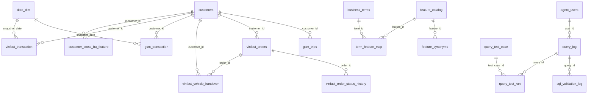

# Cấu trúc database — Feature Store Query & Reporting Agent

**Alembic revision: `0014` (head)** · PostgreSQL 16+ · 5 schema, 20 bảng, 1 view

> Tài liệu này được **sinh tự động** từ [current_schema_postgresql.sql](../backend/db/schema/current_schema_postgresql.sql), bản thân file đó là `pg_dump` của database sau `alembic upgrade head`.
> Nguồn sự thật là chuỗi migration trong [backend/migrations/versions/](../backend/migrations/versions/) — sửa schema bằng migration mới, không sửa tay file này.
> Sinh lại: `python backend/db/schema/generate_structure_doc.py` (sau khi dump lại `.sql` theo hướng dẫn trong header file đó).

## Dựng lại database

```bash
docker compose up -d db
cd backend
DATABASE_URL=postgresql+psycopg://postgres:<pass>@localhost:5432/feature_store \
    alembic upgrade head
```

Migration `0001` cần tài khoản có quyền `CREATEROLE` (tạo `feature_agent_reader` / `feature_agent_logger`). Dùng `postgres` trong docker là đủ.

## Bản đồ tổng thể

| Schema | Vai trò | Agent đọc được? |
|---|---|---|
| `raw` | Dữ liệu nguồn / event thô | **Không** — `REVOKE ALL` + default privileges revoke |
| `feature` | Bảng feature, grain `customer_id + snapshot_date` | Có (`SELECT`) |
| `metadata` | Catalog, từ đồng nghĩa, allow-list join/breakdown | Có (`SELECT`) |
| `agent` | User, query log, SQL validation log | Chỉ role logger (`INSERT`/`SELECT`) |
| `eval` | Golden set + kết quả chạy benchmark | Không cấp |



`customer_cross_bu_feature` cố ý **không** tham chiếu `date_dim` và không join với hai bảng feature kia lúc chạy — nó là bảng tính sẵn, xem [join_policy.md](join_policy.md).

## Schema `raw`

Agent **không được** query trực tiếp. Feature pipeline đọc ở đây rồi ghi xuống `feature`.

### `raw.customers`

> Customer master used as the shared customer_id across GSM and VinFast. Sensitive PII must be stored outside the agent-accessible schemas.

10 cột.

| Cột | Kiểu | NULL | Ghi chú |
|---|---|---|---|
| `customer_id` | bigint |  |  |
| `created_at` | timestamptz |  |  |
| `updated_at` | timestamptz |  |  |
| `gender` | varchar(20) | ✓ |  |
| `birth_date` | date | ✓ |  |
| `register_channel` | varchar(50) | ✓ |  |
| `residence_province` | varchar(100) | ✓ |  |
| `is_active` | boolean |  | mặc định `true`. |
| `source_system` | varchar(50) | ✓ |  |
| `ingested_at` | timestamptz |  | mặc định `CURRENT_TIMESTAMP`. |

- **Khóa chính** `customers_pkey`: `(customer_id)`
- **CHECK** `chk_customers_gender`: `CHECK (((gender IS NULL) OR ((gender)::text = ANY ((ARRAY['male'::character varying, 'female'::character varying, 'other'::character varying, 'unknown'::character varying])::text[]))))`
- **CHECK** `chk_customers_updated_at`: `CHECK ((updated_at >= created_at))`
- **Index**: `idx_customers_active` (is_active), `idx_customers_created_at` (created_at)

### `raw.date_dim`

> Calendar dimension used for daily snapshots, time windows and reporting periods.

13 cột.

| Cột | Kiểu | NULL | Ghi chú |
|---|---|---|---|
| `date_id` | date |  |  |
| `day_of_week` | smallint |  |  |
| `day_name` | varchar(20) |  |  |
| `day_of_month` | smallint |  |  |
| `week_of_month` | smallint | ✓ |  |
| `week_of_year` | smallint |  |  |
| `month_number` | smallint |  |  |
| `month_name` | varchar(20) |  |  |
| `quarter_number` | smallint |  |  |
| `year_number` | integer |  |  |
| `is_weekend` | boolean |  | mặc định `false`. |
| `is_holiday` | boolean |  | mặc định `false`. |
| `holiday_name` | varchar(200) | ✓ |  |

- **Khóa chính** `date_dim_pkey`: `(date_id)`
- **CHECK** `chk_date_dim_day_of_month`: `CHECK (((day_of_month >= 1) AND (day_of_month <= 31)))`
- **CHECK** `chk_date_dim_day_of_week`: `CHECK (((day_of_week >= 1) AND (day_of_week <= 7)))`
- **CHECK** `chk_date_dim_month`: `CHECK (((month_number >= 1) AND (month_number <= 12)))`
- **CHECK** `chk_date_dim_quarter`: `CHECK (((quarter_number >= 1) AND (quarter_number <= 4)))`
- **CHECK** `chk_date_dim_week_of_month`: `CHECK (((week_of_month IS NULL) OR ((week_of_month >= 1) AND (week_of_month <= 6))))`
- **CHECK** `chk_date_dim_week_of_year`: `CHECK (((week_of_year >= 1) AND (week_of_year <= 53)))`

### `raw.gsm_trips`

> One row per GSM trip. Source for GSM feature generation only; the agent must not query this table directly.

15 cột.

| Cột | Kiểu | NULL | Ghi chú |
|---|---|---|---|
| `trip_id` | bigint |  |  |
| `customer_id` | bigint |  |  |
| `trip_start_time` | timestamptz |  |  |
| `trip_end_time` | timestamptz | ✓ |  |
| `service_type` | varchar(30) |  |  |
| `distance_km` | numeric(12,2) | ✓ |  |
| `duration_min` | integer | ✓ |  |
| `total_fare` | numeric(18,2) |  |  |
| `discount_amount` | numeric(18,2) |  | mặc định `0`. |
| `paid_amount` | numeric(18,2) | ✓ |  |
| `payment_method` | varchar(30) | ✓ |  |
| `status` | varchar(20) |  |  |
| `created_at` | timestamptz |  |  |
| `updated_at` | timestamptz |  |  |
| `ingested_at` | timestamptz |  | mặc định `CURRENT_TIMESTAMP`. |

- **Khóa chính** `gsm_trips_pkey`: `(trip_id)`
- **Khóa ngoại** `gsm_trips_customer_id_fkey`: `(customer_id) REFERENCES raw.customers(customer_id)`
- **CHECK** `chk_gsm_trips_amounts`: `CHECK (((total_fare >= (0)::numeric) AND (discount_amount >= (0)::numeric) AND ((paid_amount IS NULL) OR (paid_amount >= (0)::numeric))))`
- **CHECK** `chk_gsm_trips_distance`: `CHECK (((distance_km IS NULL) OR (distance_km >= (0)::numeric)))`
- **CHECK** `chk_gsm_trips_duration`: `CHECK (((duration_min IS NULL) OR (duration_min >= 0)))`
- **CHECK** `chk_gsm_trips_service_type`: `CHECK (((service_type)::text = ANY ((ARRAY['taxi'::character varying, 'bike'::character varying, 'express'::character varying, 'food'::character varying, 'other'::character varying])::text[])))`
- **CHECK** `chk_gsm_trips_status`: `CHECK (((status)::text = ANY ((ARRAY['created'::character varying, 'accepted'::character varying, 'in_progress'::character varying, 'completed'::character varying, 'cancelled'::character varying])::text[])))`
- **CHECK** `chk_gsm_trips_time`: `CHECK (((trip_end_time IS NULL) OR (trip_end_time >= trip_start_time)))`
- **CHECK** `chk_gsm_trips_update_time`: `CHECK ((updated_at >= created_at))`
- **Index**: `idx_gsm_trips_customer_start` (customer_id, trip_start_time), `idx_gsm_trips_service_start` (service_type, trip_start_time), `idx_gsm_trips_status_start` (status, trip_start_time)

### `raw.vinfast_order_status_history`

> One row per (order_id, status, status_at). Point-in-time source for order state: use status_at (event time), never recorded_at and never vinfast_orders.updated_at. completed and cancelled are terminal; an order must not have both.

7 cột.

| Cột | Kiểu | NULL | Ghi chú |
|---|---|---|---|
| `status_history_id` | bigint |  |  |
| `order_id` | bigint |  |  |
| `status` | varchar(30) |  |  |
| `status_at` | timestamptz |  | When the transition happened. This is the only column allowed in point-in-time cutoffs. |
| `recorded_at` | timestamptz |  | mặc định `CURRENT_TIMESTAMP`. When the warehouse learned about it. Kept for pipeline-lag audits; never used to filter snapshots. |
| `source_system` | varchar(50) | ✓ |  |
| `ingested_at` | timestamptz |  | mặc định `CURRENT_TIMESTAMP`. |

- **Khóa chính** `vinfast_order_status_history_pkey`: `(status_history_id)`
- **Khóa ngoại** `vinfast_order_status_history_order_id_fkey`: `(order_id) REFERENCES raw.vinfast_orders(order_id)`
- **Duy nhất** `uq_vinfast_status_history`: `(order_id, status, status_at)`
- **CHECK** `chk_vinfast_status_history_recorded`: `CHECK ((recorded_at >= status_at))`
- **CHECK** `chk_vinfast_status_history_status`: `CHECK (((status)::text = ANY ((ARRAY['created'::character varying, 'processing'::character varying, 'completed'::character varying, 'cancelled'::character varying, 'delivered'::character varying])::text[])))`
- **Index**: `idx_vinfast_status_history_order_time` (order_id, status_at), `idx_vinfast_status_history_status_time` (status, status_at)

### `raw.vinfast_orders`

> One row per VinFast order. In Sprint 1, completed means completed order only; it must not be interpreted as confirmed vehicle handover or ownership.

14 cột.

| Cột | Kiểu | NULL | Ghi chú |
|---|---|---|---|
| `order_id` | bigint |  |  |
| `customer_id` | bigint |  |  |
| `created_at` | timestamptz |  |  |
| `updated_at` | timestamptz |  |  |
| `status` | varchar(30) |  |  |
| `order_type` | varchar(30) |  |  |
| `list_price` | numeric(18,2) |  |  |
| `paid_amount` | numeric(18,2) |  |  |
| `discount_amount` | numeric(18,2) GENERATED ALWAYS AS ((list_price - paid_amount)) STORED | ✓ |  |
| `has_discount` | boolean GENERATED ALWAYS AS ((list_price > paid_amount)) STORED | ✓ |  |
| `battery_kwh` | numeric(10,2) | ✓ |  |
| `vehicle_model` | varchar(50) | ✓ |  |
| `source_system` | varchar(50) | ✓ |  |
| `ingested_at` | timestamptz |  | mặc định `CURRENT_TIMESTAMP`. |

- **Khóa chính** `vinfast_orders_pkey`: `(order_id)`
- **Khóa ngoại** `vinfast_orders_customer_id_fkey`: `(customer_id) REFERENCES raw.customers(customer_id)`
- **CHECK** `chk_vinfast_orders_amounts`: `CHECK (((list_price >= (0)::numeric) AND (paid_amount >= (0)::numeric) AND (paid_amount <= list_price)))`
- **CHECK** `chk_vinfast_orders_battery`: `CHECK ((((order_type)::text = 'vehicle'::text) OR (battery_kwh IS NULL)))`
- **CHECK** `chk_vinfast_orders_status`: `CHECK (((status)::text = ANY ((ARRAY['created'::character varying, 'processing'::character varying, 'completed'::character varying, 'cancelled'::character varying, 'delivered'::character varying])::text[])))`
- **CHECK** `chk_vinfast_orders_type`: `CHECK (((order_type)::text = ANY ((ARRAY['vehicle'::character varying, 'accessories'::character varying, 'work_order'::character varying, 'nvso'::character varying])::text[])))`
- **CHECK** `chk_vinfast_orders_update_time`: `CHECK ((updated_at >= created_at))`
- **Index**: `idx_vinfast_orders_customer_created` (customer_id, created_at), `idx_vinfast_orders_status_updated` (status, updated_at), `idx_vinfast_orders_type_created` (order_type, created_at)

### `raw.vinfast_vehicle_handover`

> One row per (order_id, vehicle_id). The ONLY source of vehicle ownership. Owner at snapshot D = handover_status completed AND handed_over_at <= D AND (reversed_at IS NULL OR reversed_at > D). Ownership must never be inferred from vinfast_orders.status.

11 cột.

| Cột | Kiểu | NULL | Ghi chú |
|---|---|---|---|
| `handover_id` | bigint |  |  |
| `order_id` | bigint |  |  |
| `customer_id` | bigint |  |  |
| `vehicle_id` | varchar(50) |  |  |
| `handover_status` | varchar(20) |  |  |
| `scheduled_at` | timestamptz | ✓ |  |
| `handed_over_at` | timestamptz | ✓ |  |
| `reversed_at` | timestamptz | ✓ | Vehicle returned or swapped. Not split by reason in Sprint 2: both drop ownership of this vehicle_id. |
| `recorded_at` | timestamptz |  | mặc định `CURRENT_TIMESTAMP`. |
| `source_system` | varchar(50) | ✓ |  |
| `ingested_at` | timestamptz |  | mặc định `CURRENT_TIMESTAMP`. |

- **Khóa chính** `vinfast_vehicle_handover_pkey`: `(handover_id)`
- **Khóa ngoại** `vinfast_vehicle_handover_customer_id_fkey`: `(customer_id) REFERENCES raw.customers(customer_id)`
- **Khóa ngoại** `vinfast_vehicle_handover_order_id_fkey`: `(order_id) REFERENCES raw.vinfast_orders(order_id)`
- **Duy nhất** `uq_vinfast_handover_order_vehicle`: `(order_id, vehicle_id)`
- **CHECK** `chk_vinfast_handover_completed_needs_time`: `CHECK ((((handover_status)::text <> 'completed'::text) OR (handed_over_at IS NOT NULL)))`
- **CHECK** `chk_vinfast_handover_reversed_after_handover`: `CHECK (((reversed_at IS NULL) OR (reversed_at >= handed_over_at)))`
- **CHECK** `chk_vinfast_handover_reversed_needs_time`: `CHECK ((((handover_status)::text <> 'reversed'::text) OR ((handed_over_at IS NOT NULL) AND (reversed_at IS NOT NULL))))`
- **CHECK** `chk_vinfast_handover_status`: `CHECK (((handover_status)::text = ANY ((ARRAY['scheduled'::character varying, 'completed'::character varying, 'reversed'::character varying])::text[])))`
- **Index**: `idx_vinfast_handover_customer_time` (customer_id, handed_over_at), `idx_vinfast_handover_order` (order_id)

## Schema `feature`

Grain thống nhất: một dòng cho mỗi `customer_id` + `snapshot_date`.

### `feature.customer_cross_bu_feature`

> Pre-computed cross-BU view, one row per customer_id + snapshot_date. Answer cross-BU questions from this table instead of joining gsm_transaction with vinfast_transaction.

40 cột.

| Cột | Kiểu | NULL | Ghi chú |
|---|---|---|---|
| `customer_id` | bigint |  |  |
| `snapshot_date` | date |  |  |
| `is_active_gsm_l1m` | boolean |  |  |
| `is_active_vinfast_l1m` | boolean |  |  |
| `is_cross_bu_active_l1m` | boolean |  |  |
| `gsm_spend_l1m` | numeric(20,4) | ✓ |  |
| `vinfast_spend_l1m` | numeric(20,4) | ✓ | NULL means the customer has never had a VinFast order as of the snapshot (no data); 0 means they had orders but spent nothing in the window. |
| `combined_spend_l1m` | numeric(20,4) | ✓ |  |
| `dominant_business_unit_l1m` | varchar(10) | ✓ | GSM | VINFAST | TIE. NULL when combined spend is 0 or unknown - never silently defaults to GSM. |
| `cross_bu_engagement_score` | numeric(5,4) | ✓ | min(spend)/max(spend) over the two units: 0 = one-sided, 1 = perfectly balanced. NULL when there is nothing to compare. |
| `gsm_active_vehicle_owner_flag` | boolean |  |  |
| `feature_build_at` | timestamptz |  | mặc định `CURRENT_TIMESTAMP`. |
| `is_active_gsm_l3m` | boolean |  | mặc định `false`. |
| `is_active_gsm_l6m` | boolean |  | mặc định `false`. |
| `is_active_gsm_l12m` | boolean |  | mặc định `false`. |
| `is_active_gsm_all` | boolean |  | mặc định `false`. |
| `is_active_vinfast_l3m` | boolean |  | mặc định `false`. |
| `is_active_vinfast_l6m` | boolean |  | mặc định `false`. |
| `is_active_vinfast_l12m` | boolean |  | mặc định `false`. |
| `is_active_vinfast_all` | boolean |  | mặc định `false`. |
| `is_cross_bu_active_l3m` | boolean |  | mặc định `false`. |
| `is_cross_bu_active_l6m` | boolean |  | mặc định `false`. |
| `is_cross_bu_active_l12m` | boolean |  | mặc định `false`. |
| `is_cross_bu_active_all` | boolean |  | mặc định `false`. |
| `gsm_spend_l3m` | numeric(20,4) | ✓ |  |
| `gsm_spend_l6m` | numeric(20,4) | ✓ |  |
| `gsm_spend_l12m` | numeric(20,4) | ✓ |  |
| `gsm_spend_all` | numeric(20,4) | ✓ | Cumulative GSM spend up to snapshot_date (no rolling window). Use this for "total / to date" questions; l1m answers a different question. |
| `vinfast_spend_l3m` | numeric(20,4) | ✓ |  |
| `vinfast_spend_l6m` | numeric(20,4) | ✓ |  |
| `vinfast_spend_l12m` | numeric(20,4) | ✓ |  |
| `vinfast_spend_all` | numeric(20,4) | ✓ |  |
| `combined_spend_l3m` | numeric(20,4) | ✓ |  |
| `combined_spend_l6m` | numeric(20,4) | ✓ |  |
| `combined_spend_l12m` | numeric(20,4) | ✓ |  |
| `combined_spend_all` | numeric(20,4) | ✓ |  |
| `dominant_business_unit_l3m` | varchar(10) | ✓ |  |
| `dominant_business_unit_l6m` | varchar(10) | ✓ |  |
| `dominant_business_unit_l12m` | varchar(10) | ✓ |  |
| `dominant_business_unit_all` | varchar(10) | ✓ |  |

- **Khóa chính** `customer_cross_bu_feature_pkey`: `(customer_id, snapshot_date)`
- **Khóa ngoại** `customer_cross_bu_feature_customer_id_fkey`: `(customer_id) REFERENCES raw.customers(customer_id)`
- **CHECK** `chk_cross_bu_active_matches_parts`: `CHECK ((is_cross_bu_active_l1m = (is_active_gsm_l1m AND is_active_vinfast_l1m)))`
- **CHECK** `chk_cross_bu_active_matches_parts_all`: `CHECK ((is_cross_bu_active_all = (is_active_gsm_all AND is_active_vinfast_all)))`
- **CHECK** `chk_cross_bu_active_matches_parts_l12m`: `CHECK ((is_cross_bu_active_l12m = (is_active_gsm_l12m AND is_active_vinfast_l12m)))`
- **CHECK** `chk_cross_bu_active_matches_parts_l3m`: `CHECK ((is_cross_bu_active_l3m = (is_active_gsm_l3m AND is_active_vinfast_l3m)))`
- **CHECK** `chk_cross_bu_active_matches_parts_l6m`: `CHECK ((is_cross_bu_active_l6m = (is_active_gsm_l6m AND is_active_vinfast_l6m)))`
- **CHECK** `chk_cross_bu_dominant_unit`: `CHECK (((dominant_business_unit_l1m IS NULL) OR ((dominant_business_unit_l1m)::text = ANY ((ARRAY['GSM'::character varying, 'VINFAST'::character varying, 'TIE'::character varying])::text[]))))`
- **CHECK** `chk_cross_bu_dominant_unit_all`: `CHECK (((dominant_business_unit_all IS NULL) OR ((dominant_business_unit_all)::text = ANY ((ARRAY['GSM'::character varying, 'VINFAST'::character varying, 'TIE'::character varying])::text[]))))`
- **CHECK** `chk_cross_bu_dominant_unit_l12m`: `CHECK (((dominant_business_unit_l12m IS NULL) OR ((dominant_business_unit_l12m)::text = ANY ((ARRAY['GSM'::character varying, 'VINFAST'::character varying, 'TIE'::character varying])::text[]))))`
- **CHECK** `chk_cross_bu_dominant_unit_l3m`: `CHECK (((dominant_business_unit_l3m IS NULL) OR ((dominant_business_unit_l3m)::text = ANY ((ARRAY['GSM'::character varying, 'VINFAST'::character varying, 'TIE'::character varying])::text[]))))`
- **CHECK** `chk_cross_bu_dominant_unit_l6m`: `CHECK (((dominant_business_unit_l6m IS NULL) OR ((dominant_business_unit_l6m)::text = ANY ((ARRAY['GSM'::character varying, 'VINFAST'::character varying, 'TIE'::character varying])::text[]))))`
- **CHECK** `chk_cross_bu_score_range`: `CHECK (((cross_bu_engagement_score IS NULL) OR ((cross_bu_engagement_score >= (0)::numeric) AND (cross_bu_engagement_score <= (1)::numeric))))`
- **CHECK** `chk_cross_bu_spend_non_negative`: `CHECK ((((gsm_spend_l1m IS NULL) OR (gsm_spend_l1m >= (0)::numeric)) AND ((vinfast_spend_l1m IS NULL) OR (vinfast_spend_l1m >= (0)::numeric)) AND ((combined_spend_l1m IS NULL) OR (combined_spend_l1m >= (0)::numeric))))`
- **Index**: `idx_cross_bu_active` (snapshot_date, is_cross_bu_active_l1m), `idx_cross_bu_snapshot` (snapshot_date)

### `feature.gsm_transaction`

> GSM feature table. One row per customer and snapshot date. Agent-readable.

190 cột.

**Cột lõi (23)**

| Cột | Kiểu | NULL | Ghi chú |
|---|---|---|---|
| `customer_id` | bigint |  |  |
| `snapshot_date` | date |  |  |
| `completed_txn_amount_l1m` | numeric(18,2) |  | mặc định `0`. |
| `completed_txn_amount_l3m` | numeric(18,2) |  | mặc định `0`. |
| `completed_txn_amount_l12m` | numeric(18,2) |  | mặc định `0`. |
| `completed_distance_l1m` | numeric(18,2) |  | mặc định `0`. |
| `completed_duration_l1m` | numeric(18,2) |  | mặc định `0`. |
| `avg_ticket_l1m` | numeric(18,2) | ✓ |  |
| `avg_distance_l1m` | numeric(12,2) | ✓ |  |
| `completed_rate_l1m` | numeric(8,4) | ✓ |  |
| `taxi_completed_count_l1m` | integer |  | mặc định `0`. |
| `bike_completed_count_l1m` | integer |  | mặc định `0`. |
| `express_completed_count_l1m` | integer |  | mặc định `0`. |
| `food_completed_count_l1m` | integer |  | mặc định `0`. |
| `txn_count_l1m_vs_l3m` | numeric(12,4) | ✓ |  |
| `txn_amount_l1m_vs_l3m` | numeric(12,4) | ✓ |  |
| `txn_count_l3m_vs_l12m` | numeric(12,4) | ✓ |  |
| `first_trip_date` | date | ✓ |  |
| `last_trip_date` | date | ✓ |  |
| `active_days_l1m` | integer |  | mặc định `0`. |
| `days_since_last_trip` | integer | ✓ |  |
| `is_active_l1m` | boolean |  | mặc định `false`. |
| `feature_build_at` | timestamptz |  | mặc định `CURRENT_TIMESTAMP`. |

**Cột theo inventory (167) — `{stem}_{window}`, 28 stem** (migration `0002`)

| Stem | Kiểu | Cửa sổ có sẵn |
|---|---|---|
| `canceled_original_price_max` | numeric(20,4) | `daily`, `l1w`, `l2w`, `l1m`, `l3m`, `l6m`, `l12m` |
| `canceled_original_price_sum` | numeric(20,4) | `daily`, `l1w`, `l2w`, `l1m`, `l3m`, `l6m`, `l12m` |
| `canceled_txn_active_day_count` | integer | `daily`, `l1w`, `l2w`, `l1m`, `l3m`, `l6m`, `l12m` |
| `canceled_txn_count` | integer | `daily`, `l1w`, `l2w`, `l1m`, `l3m`, `l6m`, `l12m` |
| `canceled_weekday_original_price_sum` | numeric(20,4) | `l1w`, `l2w`, `l1m`, `l3m`, `l6m`, `l12m` |
| `canceled_weekday_txn_count` | integer | `l1w`, `l2w`, `l1m`, `l3m`, `l6m`, `l12m` |
| `completed_discount_amount_sum` | numeric(20,4) | `daily`, `l1w`, `l2w`, `l1m`, `l3m`, `l6m`, `l12m` |
| `completed_original_price_max` | numeric(20,4) | `daily`, `l1w`, `l2w`, `l1m`, `l3m`, `l6m`, `l12m` |
| `completed_original_price_sum` | numeric(18,6) | `daily`, `l1w`, `l2w`, `l1m`, `l3m`, `l6m`, `l12m`, `l1m_vs_l3m`, `l1m_vs_l6m`, `l3m_vs_l12m` |
| `completed_trip_distance_km_sum` | numeric(18,6) | `daily`, `l1w`, `l2w`, `l1m`, `l3m`, `l6m`, `l12m`, `l1m_vs_l3m`, `l1m_vs_l6m`, `l3m_vs_l12m` |
| `completed_txn_active_day_count` | integer | `daily`, `l1w`, `l2w`, `l1m`, `l3m`, `l6m`, `l12m` |
| `completed_txn_count` | integer | `daily`, `l1w`, `l2w`, `l1m`, `l3m`, `l6m`, `l12m` |
| `completed_weekday_original_price_sum` | numeric(20,4) | `l1w`, `l2w`, `l1m`, `l3m`, `l6m`, `l12m` |
| `completed_weekday_txn_count` | integer | `l1w`, `l2w`, `l1m`, `l3m`, `l6m`, `l12m` |
| `days_since_first_txn` | integer | `l12m` |
| `days_since_last_txn` | integer | `l12m` |
| `finished_original_price_max` | numeric(20,4) | `daily`, `l1w`, `l2w`, `l1m`, `l3m`, `l6m`, `l12m` |
| `finished_original_price_sum` | numeric(20,4) | `daily`, `l1w`, `l2w`, `l1m`, `l3m`, `l6m`, `l12m` |
| `finished_time_daytime_original_price_sum` | numeric(20,4) | `daily`, `l1w`, `l2w`, `l1m`, `l3m`, `l6m`, `l12m` |
| `finished_time_daytime_txn_count` | integer | `daily`, `l1w`, `l2w`, `l1m`, `l3m`, `l6m`, `l12m` |
| `finished_txn_active_day_count` | integer | `daily`, `l1w`, `l2w`, `l1m`, `l3m`, `l6m`, `l12m` |
| `finished_txn_count` | numeric(18,6) | `daily`, `l1w`, `l2w`, `l1m`, `l3m`, `l6m`, `l12m`, `l1m_vs_l3m`, `l1m_vs_l6m`, `l3m_vs_l12m` |
| `finished_type_bike_txn_count` | integer | `l1w`, `l2w` |
| `finished_type_express_txn_count` | integer | `l1w`, `l2w` |
| `finished_type_food_txn_count` | integer | `l1w`, `l2w` |
| `finished_type_taxi_txn_count` | integer | `l1w`, `l2w` |
| `finished_weekday_original_price_sum` | numeric(20,4) | `l1w`, `l2w`, `l1m`, `l3m`, `l6m`, `l12m` |
| `finished_weekday_txn_count` | integer | `l1w`, `l2w`, `l1m`, `l3m`, `l6m`, `l12m` |

- **Khóa chính** `gsm_transaction_pkey`: `(customer_id, snapshot_date)`
- **Khóa ngoại** `gsm_transaction_customer_id_fkey`: `(customer_id) REFERENCES raw.customers(customer_id)`
- **Khóa ngoại** `gsm_transaction_snapshot_date_fkey`: `(snapshot_date) REFERENCES raw.date_dim(date_id)`
- **CHECK** `chk_gsm_feature_date_order`: `CHECK (((first_trip_date IS NULL) OR (last_trip_date IS NULL) OR (first_trip_date <= last_trip_date)))`
- **CHECK** `chk_gsm_feature_non_negative_counts`: `CHECK (((completed_txn_count_daily >= 0) AND (completed_txn_count_l1w >= 0) AND (completed_txn_count_l1m >= 0) AND (completed_txn_count_l3m >= 0) AND (completed_txn_count_l6m >= 0) AND (completed_txn_count_l12m >= 0) AND (taxi_completed_count_l1m >= 0) AND (bike_completed_count_l1m >= 0) AND (expres`
- **CHECK** `chk_gsm_feature_rate`: `CHECK (((completed_rate_l1m IS NULL) OR ((completed_rate_l1m >= (0)::numeric) AND (completed_rate_l1m <= (1)::numeric))))`
- **Index**: `idx_gsm_transaction_active` (snapshot_date, is_active_l1m), `idx_gsm_transaction_snapshot` (snapshot_date)

### `feature.vinfast_transaction`

> VinFast feature table. One row per customer and snapshot date. Sprint 1 supports buyer/order analysis only, not confirmed vehicle ownership.

234 cột.

**Cột lõi (48)**

| Cột | Kiểu | NULL | Ghi chú |
|---|---|---|---|
| `customer_id` | bigint |  |  |
| `snapshot_date` | date |  |  |
| `order_created_count_daily` | integer |  | mặc định `0`. |
| `order_created_count_l1m` | integer |  | mặc định `0`. |
| `order_created_count_l3m` | integer |  | mặc định `0`. |
| `order_created_count_l12m` | integer |  | mặc định `0`. |
| `completed_order_count_l1m` | integer |  | mặc định `0`. |
| `completed_order_count_l3m` | integer |  | mặc định `0`. |
| `completed_order_count_l12m` | integer |  | mặc định `0`. |
| `vehicle_order_count_l1m` | integer |  | mặc định `0`. |
| `vehicle_completed_order_count_l1m` | integer |  | mặc định `0`. |
| `accessories_order_count_l1m` | integer |  | mặc định `0`. |
| `work_order_count_l1m` | integer |  | mặc định `0`. |
| `nvso_order_count_l1m` | integer |  | mặc định `0`. |
| `order_amount_l1m` | numeric(18,2) |  | mặc định `0`. |
| `order_amount_l3m` | numeric(18,2) |  | mặc định `0`. |
| `order_amount_l12m` | numeric(18,2) |  | mặc định `0`. |
| `vehicle_amount_l1m` | numeric(18,2) |  | mặc định `0`. |
| `accessories_amount_l1m` | numeric(18,2) |  | mặc định `0`. |
| `discount_order_count_l1m` | integer |  | mặc định `0`. |
| `discount_amount_l1m` | numeric(18,2) |  | mặc định `0`. |
| `avg_order_value_l1m` | numeric(18,2) | ✓ |  |
| `avg_vehicle_order_value_l1m` | numeric(18,2) | ✓ |  |
| `battery_kwh_sum_l1m` | numeric(18,2) | ✓ |  |
| `order_count_l1m_vs_l3m` | numeric(12,4) | ✓ |  |
| `amount_l1m_vs_l3m` | numeric(12,4) | ✓ |  |
| `order_count_l3m_vs_l12m` | numeric(12,4) | ✓ |  |
| `first_order_date` | date | ✓ |  |
| `last_order_date` | date | ✓ |  |
| `first_vehicle_purchase_date` | date | ✓ |  |
| `days_since_last_order` | integer | ✓ |  |
| `is_vinfast_buyer` | boolean |  | mặc định `false`. |
| `feature_build_at` | timestamptz |  | mặc định `CURRENT_TIMESTAMP`. |
| `vehicle_purchase_completed_count_l1m` | integer | ✓ |  |
| `vehicle_delivered_count_l1m` | integer | ✓ |  |
| `is_vehicle_buyer` | boolean | ✓ | TRUE when a vehicle order reached completed in the status history as of snapshot_date. Buying is not receiving. |
| `is_vehicle_owner` | boolean | ✓ | TRUE when the customer had a completed, non-reversed vehicle handover as of snapshot_date. Never derive this from order status. |
| `first_vehicle_handover_date` | date | ✓ |  |
| `days_since_last_vehicle_handover` | integer | ✓ |  |
| `vehicle_purchase_completed_count_l3m` | integer | ✓ |  |
| `vehicle_purchase_completed_count_l6m` | integer | ✓ |  |
| `vehicle_purchase_completed_count_l12m` | integer | ✓ |  |
| `vehicle_purchase_completed_count_all` | integer | ✓ |  |
| `vehicle_delivered_count_l3m` | integer | ✓ |  |
| `vehicle_delivered_count_l6m` | integer | ✓ |  |
| `vehicle_delivered_count_l12m` | integer | ✓ |  |
| `vehicle_delivered_count_all` | integer | ✓ |  |
| `is_vehicle_handover_scheduled` | boolean | ✓ | TRUE when a handover was scheduled on or before the snapshot but not yet completed. Scheduled is not ownership. |

**Cột theo inventory (186) — `{stem}_{window}`, 34 stem** (migration `0002`)

| Stem | Kiểu | Cửa sổ có sẵn |
|---|---|---|
| `days_since_first_completed_txn_days` | integer | `daily`, `l1w`, `l2w`, `l1m`, `l3m`, `l6m`, `l12m` |
| `days_since_last_completed_txn_days` | integer | `daily`, `l1w`, `l2w`, `l1m`, `l3m`, `l6m`, `l12m` |
| `txn_accessories_canceled_amount_sum` | numeric(18,6) | `l1m_vs_l3m`, `l1m_vs_l6m`, `l1m_vs_l12m`, `l3m_vs_l12m` |
| `txn_accessories_canceled_count` | numeric(18,6) | `l1m_vs_l3m`, `l1m_vs_l6m`, `l1m_vs_l12m`, `l3m_vs_l12m` |
| `txn_accessories_canceled_price_sum` | numeric(18,6) | `l1m_vs_l3m`, `l1m_vs_l6m`, `l1m_vs_l12m`, `l3m_vs_l12m` |
| `txn_accessories_completed_amount_sum` | numeric(18,6) | `l1m_vs_l3m`, `l1m_vs_l6m`, `l1m_vs_l12m`, `l3m_vs_l12m` |
| `txn_accessories_completed_count` | numeric(18,6) | `l12m`, `l1m_vs_l3m`, `l1m_vs_l6m`, `l1m_vs_l12m`, `l3m_vs_l12m` |
| `txn_accessories_completed_price_sum` | numeric(18,6) | `l12m`, `l1m_vs_l3m`, `l1m_vs_l6m`, `l1m_vs_l12m`, `l3m_vs_l12m` |
| `txn_canceled_active_day_count` | integer | `daily`, `l1w`, `l2w`, `l1m`, `l3m`, `l6m`, `l12m` |
| `txn_canceled_amount_sum` | numeric(20,4) | `daily`, `l1w`, `l2w`, `l1m`, `l3m`, `l6m`, `l12m` |
| `txn_canceled_count` | integer | `daily`, `l1w`, `l2w`, `l1m`, `l3m`, `l6m`, `l12m` |
| `txn_canceled_price_sum` | numeric(20,4) | `daily`, `l1w`, `l2w`, `l1m`, `l3m`, `l6m`, `l12m` |
| `txn_canceled_processing_time_max` | numeric(20,4) | `daily`, `l1w`, `l2w`, `l1m`, `l3m`, `l6m`, `l12m` |
| `txn_canceled_processing_time_min` | numeric(20,4) | `daily`, `l1w`, `l2w`, `l1m`, `l3m`, `l6m`, `l12m` |
| `txn_completed_active_day_count` | integer | `daily`, `l1w`, `l2w`, `l1m`, `l3m`, `l6m`, `l12m` |
| `txn_completed_amount_sum` | numeric(20,4) | `daily`, `l1w`, `l2w`, `l1m`, `l3m`, `l6m`, `l12m` |
| `txn_completed_battery_sum` | numeric(20,4) | `l12m` |
| `txn_completed_count` | integer | `daily`, `l1w`, `l2w`, `l1m`, `l3m`, `l6m`, `l12m` |
| `txn_completed_price_sum` | numeric(20,4) | `daily`, `l1w`, `l2w`, `l1m`, `l3m`, `l6m`, `l12m` |
| `txn_completed_processing_time_max` | numeric(20,4) | `daily`, `l1w`, `l2w`, `l1m`, `l3m`, `l6m`, `l12m` |
| `txn_completed_processing_time_min` | numeric(20,4) | `daily`, `l1w`, `l2w`, `l1m`, `l3m`, `l6m`, `l12m` |
| `txn_discount_accessories_completed_count` | integer | `l12m` |
| `txn_discount_canceled_count` | integer | `daily`, `l1w`, `l2w`, `l1m`, `l3m`, `l6m`, `l12m` |
| `txn_discount_completed_count` | integer | `daily`, `l1w`, `l2w`, `l1m`, `l3m`, `l6m`, `l12m` |
| `txn_discount_delivered_count` | integer | `daily`, `l1w`, `l2w`, `l1m`, `l3m`, `l6m`, `l12m` |
| `txn_discount_nvso_completed_count` | integer | `l12m` |
| `txn_first_completed_updated_date_min` | date | `daily`, `l1w`, `l2w`, `l1m`, `l3m`, `l6m`, `l12m` |
| `txn_last_completed_updated_date_max` | date | `daily`, `l1w`, `l2w`, `l1m`, `l3m`, `l6m`, `l12m` |
| `txn_wo_canceled_amount_sum` | numeric(18,6) | `l1m_vs_l3m`, `l1m_vs_l6m`, `l1m_vs_l12m`, `l3m_vs_l12m` |
| `txn_wo_canceled_count` | numeric(18,6) | `l1m_vs_l3m`, `l1m_vs_l6m`, `l1m_vs_l12m`, `l3m_vs_l12m` |
| `txn_wo_canceled_price_sum` | numeric(18,6) | `l1m_vs_l3m`, `l1m_vs_l6m`, `l1m_vs_l12m`, `l3m_vs_l12m` |
| `txn_wo_completed_amount_sum` | numeric(18,6) | `l1m_vs_l3m`, `l1m_vs_l6m`, `l1m_vs_l12m`, `l3m_vs_l12m` |
| `txn_wo_completed_count` | numeric(18,6) | `l1m_vs_l3m`, `l1m_vs_l6m`, `l1m_vs_l12m`, `l3m_vs_l12m` |
| `txn_wo_completed_price_sum` | numeric(18,6) | `l1m_vs_l3m`, `l1m_vs_l6m`, `l1m_vs_l12m`, `l3m_vs_l12m` |

- **Khóa chính** `vinfast_transaction_pkey`: `(customer_id, snapshot_date)`
- **Khóa ngoại** `vinfast_transaction_customer_id_fkey`: `(customer_id) REFERENCES raw.customers(customer_id)`
- **Khóa ngoại** `vinfast_transaction_snapshot_date_fkey`: `(snapshot_date) REFERENCES raw.date_dim(date_id)`
- **CHECK** `chk_vinfast_feature_date_order`: `CHECK (((first_order_date IS NULL) OR (last_order_date IS NULL) OR (first_order_date <= last_order_date)))`
- **CHECK** `chk_vinfast_feature_non_negative_counts`: `CHECK (((order_created_count_daily >= 0) AND (order_created_count_l1m >= 0) AND (order_created_count_l3m >= 0) AND (order_created_count_l12m >= 0) AND (completed_order_count_l1m >= 0) AND (completed_order_count_l3m >= 0) AND (completed_order_count_l12m >= 0) AND (vehicle_order_count_l1m >= 0) AND (v`
- **Index**: `idx_vinfast_transaction_buyer` (snapshot_date, is_vinfast_buyer), `idx_vinfast_transaction_snapshot` (snapshot_date)

## Schema `metadata`

Tầng ngữ nghĩa: retriever và validator đọc bảng ở đây để chọn cột và duyệt JOIN.

### `metadata.breakdown_catalog`

11 cột.

| Cột | Kiểu | NULL | Ghi chú |
|---|---|---|---|
| `dimension_key` | text |  |  |
| `label_vi` | text |  |  |
| `aliases` | text[] |  | mặc định `'{}'::text[]`. |
| `strategy` | text |  |  |
| `source_tables` | text[] |  | mặc định `'{}'::text[]`. |
| `members` | jsonb |  | mặc định `'[]'::jsonb`. |
| `compatible_dimensions` | text[] |  | mặc định `'{}'::text[]`. |
| `overlap_possible` | boolean |  | mặc định `false`. |
| `is_active` | boolean |  | mặc định `true`. |
| `created_at` | timestamptz |  | mặc định `CURRENT_TIMESTAMP`. |
| `updated_at` | timestamptz |  | mặc định `CURRENT_TIMESTAMP`. |

- **Khóa chính** `breakdown_catalog_pkey`: `(dimension_key)`
- **CHECK** `chk_breakdown_strategy`: `CHECK ((strategy = ANY (ARRAY['pivot_feature'::text, 'boolean_segment'::text, 'physical_column'::text])))`

### `metadata.business_terms`

> Business glossary used to clarify ambiguous Vietnamese terms such as VIP, active customer, buyer and owner.

9 cột.

| Cột | Kiểu | NULL | Ghi chú |
|---|---|---|---|
| `term_id` | bigint |  |  |
| `term_text` | varchar(200) |  |  |
| `business_unit` | varchar(50) | ✓ |  |
| `definition` | text |  |  |
| `clarification_text` | text | ✓ |  |
| `is_ambiguous` | boolean |  | mặc định `false`. |
| `is_active` | boolean |  | mặc định `true`. |
| `created_at` | timestamptz |  | mặc định `CURRENT_TIMESTAMP`. |
| `updated_at` | timestamptz |  | mặc định `CURRENT_TIMESTAMP`. |

- **Khóa chính** `business_terms_pkey`: `(term_id)`
- **Duy nhất** `uq_business_term`: `(term_text, business_unit)`
- **CHECK** `chk_business_terms_bu`: `CHECK (((business_unit IS NULL) OR ((business_unit)::text = ANY ((ARRAY['GSM'::character varying, 'VINFAST'::character varying, 'GLOBAL'::character varying])::text[]))))`

### `metadata.feature_catalog`

> Canonical registry for feature retrieval, SQL generation and business explanations.

22 cột.

| Cột | Kiểu | NULL | Ghi chú |
|---|---|---|---|
| `feature_id` | bigint |  |  |
| `feature_name` | varchar(200) |  |  |
| `table_schema` | varchar(100) |  | mặc định `'feature'::character varying`. |
| `table_name` | varchar(100) |  |  |
| `business_unit` | varchar(50) |  |  |
| `feature_group` | varchar(100) | ✓ |  |
| `description_vi` | text |  |  |
| `description_en` | text | ✓ |  |
| `data_type` | varchar(50) |  |  |
| `aggregation_type` | varchar(50) | ✓ |  |
| `time_window` | varchar(30) | ✓ |  |
| `source_schema` | varchar(100) | ✓ |  |
| `source_table` | varchar(100) | ✓ |  |
| `source_column` | varchar(200) | ✓ |  |
| `calculation_expression` | text | ✓ |  |
| `null_meaning` | text | ✓ |  |
| `unit` | varchar(50) | ✓ |  |
| `sensitivity_level` | varchar(30) |  | mặc định `'internal'::character varying`. |
| `is_queryable` | boolean |  | mặc định `true`. |
| `is_active` | boolean |  | mặc định `true`. |
| `created_at` | timestamptz |  | mặc định `CURRENT_TIMESTAMP`. |
| `updated_at` | timestamptz |  | mặc định `CURRENT_TIMESTAMP`. |

- **Khóa chính** `feature_catalog_pkey`: `(feature_id)`
- **Duy nhất** `feature_catalog_feature_name_key`: `(feature_name)`
- **Duy nhất** `uq_feature_catalog_location`: `(table_schema, table_name, feature_name)`
- **CHECK** `chk_feature_catalog_bu`: `CHECK (((business_unit)::text = ANY ((ARRAY['GSM'::character varying, 'VINFAST'::character varying, 'CROSS_BU'::character varying])::text[])))`
- **CHECK** `chk_feature_catalog_sensitivity`: `CHECK (((sensitivity_level)::text = ANY ((ARRAY['public'::character varying, 'internal'::character varying, 'restricted'::character varying])::text[])))`
- **Index**: `idx_feature_catalog_group` (business_unit, feature_group), `idx_feature_catalog_queryable` (is_active, is_queryable), `idx_feature_catalog_table` (table_schema, table_name)

### `metadata.feature_synonyms`

7 cột.

| Cột | Kiểu | NULL | Ghi chú |
|---|---|---|---|
| `synonym_id` | bigint |  |  |
| `feature_id` | bigint |  |  |
| `synonym_text` | varchar(200) |  |  |
| `language_code` | varchar(10) |  | mặc định `'vi'::character varying`. |
| `synonym_type` | varchar(30) |  | mặc định `'business'::character varying`. |
| `is_active` | boolean |  | mặc định `true`. |
| `created_at` | timestamptz |  | mặc định `CURRENT_TIMESTAMP`. |

- **Khóa chính** `feature_synonyms_pkey`: `(synonym_id)`
- **Khóa ngoại** `feature_synonyms_feature_id_fkey`: `(feature_id) REFERENCES metadata.feature_catalog(feature_id) ON DELETE CASCADE`
- **Duy nhất** `uq_feature_synonym`: `(feature_id, synonym_text, language_code)`
- **CHECK** `chk_feature_synonym_type`: `CHECK (((synonym_type)::text = ANY ((ARRAY['business'::character varying, 'technical'::character varying, 'abbreviation'::character varying, 'natural_language'::character varying])::text[])))`
- **Index**: `idx_feature_synonyms_feature` (feature_id, is_active), `idx_feature_synonyms_text` (synonym_text)

### `metadata.join_catalog`

> Allow-list of table pairs the agent may join, with the mandatory join keys. Any join not matching an active row here is rejected at validation time.

11 cột.

| Cột | Kiểu | NULL | Ghi chú |
|---|---|---|---|
| `join_id` | integer |  |  |
| `left_table` | text |  |  |
| `right_table` | text |  |  |
| `join_keys` | text[] |  |  |
| `join_type` | text |  |  |
| `cardinality` | text |  |  |
| `requires_snapshot_key` | boolean |  | mặc định `true`. |
| `allowed_intents` | text[] |  | mặc định `'{}'::text[]`. |
| `explanation_vi` | text |  |  |
| `is_active` | boolean |  | mặc định `true`. |
| `created_at` | timestamptz |  | mặc định `CURRENT_TIMESTAMP`. |

- **Khóa chính** `join_catalog_pkey`: `(join_id)`
- **Duy nhất** `uq_join_catalog_pair`: `(left_table, right_table)`
- **CHECK** `chk_join_catalog_cardinality`: `CHECK ((cardinality = ANY (ARRAY['1:1'::text, '1:n'::text, 'n:1'::text])))`
- **CHECK** `chk_join_catalog_has_keys`: `CHECK ((array_length(join_keys, 1) >= 1))`
- **CHECK** `chk_join_catalog_snapshot_key`: `CHECK (((NOT requires_snapshot_key) OR ('snapshot_date'::text = ANY (join_keys))))`
- **CHECK** `chk_join_catalog_type`: `CHECK ((join_type = ANY (ARRAY['inner'::text, 'left'::text, 'full'::text])))`

### `metadata.term_feature_map`

7 cột.

| Cột | Kiểu | NULL | Ghi chú |
|---|---|---|---|
| `term_feature_map_id` | bigint |  |  |
| `term_id` | bigint |  |  |
| `feature_id` | bigint |  |  |
| `relevance_score` | numeric(5,4) |  | mặc định `1`. |
| `mapping_type` | varchar(30) |  | mặc định `'direct'::character varying`. |
| `is_active` | boolean |  | mặc định `true`. |
| `created_at` | timestamptz |  | mặc định `CURRENT_TIMESTAMP`. |

- **Khóa chính** `term_feature_map_pkey`: `(term_feature_map_id)`
- **Khóa ngoại** `term_feature_map_feature_id_fkey`: `(feature_id) REFERENCES metadata.feature_catalog(feature_id) ON DELETE CASCADE`
- **Khóa ngoại** `term_feature_map_term_id_fkey`: `(term_id) REFERENCES metadata.business_terms(term_id) ON DELETE CASCADE`
- **Duy nhất** `uq_term_feature_map`: `(term_id, feature_id)`
- **CHECK** `chk_term_feature_mapping_type`: `CHECK (((mapping_type)::text = ANY ((ARRAY['direct'::character varying, 'derived'::character varying, 'supporting'::character varying, 'exclusion'::character varying])::text[])))`
- **CHECK** `chk_term_feature_relevance`: `CHECK (((relevance_score >= (0)::numeric) AND (relevance_score <= (1)::numeric)))`
- **Index**: `idx_term_feature_map_feature` (feature_id, is_active), `idx_term_feature_map_term` (term_id, is_active)

### `metadata.queryable_feature_view` (view)

```sql
SELECT fc.feature_id,
    fc.feature_name,
    fc.table_schema,
    fc.table_name,
    fc.business_unit,
    fc.feature_group,
    fc.description_vi,
    fc.data_type,
    fc.aggregation_type,
    fc.time_window,
    fc.unit,
    fc.null_meaning,
    COALESCE(jsonb_agg(DISTINCT jsonb_build_object('text', fs.synonym_text, 'language', fs.language_code, 'type', fs.synonym_type)) FILTER (WHERE (fs.synonym_id IS NOT NULL)), '[]'::jsonb) AS synonyms
   FROM (metadata.feature_catalog fc
     LEFT JOIN metadata.feature_synonyms fs ON (((fs.feature_id = fc.feature_id) AND (fs.is_active = true))))
  WHERE ((fc.is_active = true) AND (fc.is_queryable = true) AND ((fc.sensitivity_level)::text <> 'restricted'::text))
  GROUP BY fc.feature_id, fc.feature_name, fc.table_schema, fc.table_name, fc.business_unit, fc.feature_group, fc.description_vi, fc.data_type, fc.aggregation_type, fc.time_window, fc.unit, fc.null_meaning
```

## Schema `agent`

Audit toàn bộ vòng đời Text-to-SQL.

### `agent.agent_users`

9 cột.

| Cột | Kiểu | NULL | Ghi chú |
|---|---|---|---|
| `user_id` | bigint |  |  |
| `username` | varchar(100) |  |  |
| `display_name` | varchar(200) | ✓ |  |
| `email` | varchar(200) | ✓ |  |
| `role` | varchar(30) |  |  |
| `business_unit` | varchar(50) | ✓ |  |
| `is_active` | boolean |  | mặc định `true`. |
| `created_at` | timestamptz |  | mặc định `CURRENT_TIMESTAMP`. |
| `updated_at` | timestamptz |  | mặc định `CURRENT_TIMESTAMP`. |

- **Khóa chính** `agent_users_pkey`: `(user_id)`
- **Duy nhất** `agent_users_email_key`: `(email)`
- **Duy nhất** `agent_users_username_key`: `(username)`
- **CHECK** `chk_agent_users_bu`: `CHECK (((business_unit IS NULL) OR ((business_unit)::text = ANY ((ARRAY['GSM'::character varying, 'VINFAST'::character varying, 'GLOBAL'::character varying])::text[]))))`
- **CHECK** `chk_agent_users_role`: `CHECK (((role)::text = ANY ((ARRAY['business_user'::character varying, 'analyst'::character varying, 'engineer'::character varying, 'admin'::character varying])::text[])))`

### `agent.query_log`

> Audit log for the full Text-to-SQL lifecycle: question, retrieval, selected features, SQL, validation, execution and result preview.

26 cột.

| Cột | Kiểu | NULL | Ghi chú |
|---|---|---|---|
| `query_id` | bigint |  |  |
| `user_id` | bigint | ✓ |  |
| `session_id` | varchar(100) | ✓ |  |
| `query_text` | text |  |  |
| `normalized_query` | text | ✓ |  |
| `detected_intent` | varchar(100) | ✓ |  |
| `selected_business_unit` | varchar(50) | ✓ |  |
| `selected_tables` | jsonb | ✓ |  |
| `retrieved_features` | jsonb | ✓ |  |
| `selected_features` | jsonb | ✓ |  |
| `generated_sql` | text | ✓ |  |
| `validated_sql` | text | ✓ |  |
| `execution_status` | varchar(30) |  |  |
| `row_count` | bigint | ✓ |  |
| `execution_time_ms` | integer | ✓ |  |
| `confidence_score` | numeric(5,4) | ✓ |  |
| `warning_message` | text | ✓ |  |
| `error_message` | text | ✓ |  |
| `result_preview` | jsonb | ✓ |  |
| `created_at` | timestamptz |  | mặc định `CURRENT_TIMESTAMP`. |
| `join_plan` | jsonb | ✓ |  |
| `state_transition` | jsonb | ✓ |  |
| `visualization_spec` | jsonb | ✓ |  |
| `partial_answer` | boolean | ✓ |  |
| `coverage_warning` | jsonb | ✓ |  |
| `breakdown_plan` | jsonb | ✓ |  |

- **Khóa chính** `query_log_pkey`: `(query_id)`
- **Khóa ngoại** `query_log_user_id_fkey`: `(user_id) REFERENCES agent.agent_users(user_id)`
- **CHECK** `chk_query_log_confidence`: `CHECK (((confidence_score IS NULL) OR ((confidence_score >= (0)::numeric) AND (confidence_score <= (1)::numeric))))`
- **CHECK** `chk_query_log_execution_time`: `CHECK (((execution_time_ms IS NULL) OR (execution_time_ms >= 0)))`
- **CHECK** `chk_query_log_row_count`: `CHECK (((row_count IS NULL) OR (row_count >= 0)))`
- **CHECK** `chk_query_log_status`: `CHECK (((execution_status)::text = ANY ((ARRAY['received'::character varying, 'retrieved'::character varying, 'clarification_required'::character varying, 'generated'::character varying, 'validated'::character varying, 'executed'::character varying, 'rejected'::character varying, 'failed'::character`
- **Index**: `idx_query_log_business_unit` (selected_business_unit, created_at DESC), `idx_query_log_status_time` (execution_status, created_at DESC), `idx_query_log_user_time` (user_id, created_at DESC)

### `agent.sql_validation_log`

> Stores SQL validator results. Sprint 1 must enforce SELECT-only access to approved feature and metadata tables.

16 cột.

| Cột | Kiểu | NULL | Ghi chú |
|---|---|---|---|
| `validation_id` | bigint |  |  |
| `query_id` | bigint |  |  |
| `validator_version` | varchar(50) | ✓ |  |
| `sql_text` | text |  |  |
| `is_select_only` | boolean |  | mặc định `false`. |
| `has_select_star` | boolean |  | mặc định `false`. |
| `accesses_raw_schema` | boolean |  | mặc định `false`. |
| `accesses_restricted_data` | boolean |  | mặc định `false`. |
| `has_disallowed_statement` | boolean |  | mặc định `false`. |
| `has_row_limit` | boolean |  | mặc định `false`. |
| `referenced_tables` | jsonb | ✓ |  |
| `referenced_columns` | jsonb | ✓ |  |
| `validation_errors` | jsonb | ✓ |  |
| `validation_warnings` | jsonb | ✓ |  |
| `is_valid` | boolean |  |  |
| `validated_at` | timestamptz |  | mặc định `CURRENT_TIMESTAMP`. |

- **Khóa chính** `sql_validation_log_pkey`: `(validation_id)`
- **Khóa ngoại** `sql_validation_log_query_id_fkey`: `(query_id) REFERENCES agent.query_log(query_id) ON DELETE CASCADE`
- **Index**: `idx_sql_validation_query` (query_id), `idx_sql_validation_validated_at` (validated_at DESC)

## Schema `eval`

Đo độ chính xác; không nằm trong đường chạy runtime.

### `eval.query_test_case`

> Golden test set used to measure retrieval accuracy, feature selection accuracy, SQL validity and answer accuracy.

15 cột.

| Cột | Kiểu | NULL | Ghi chú |
|---|---|---|---|
| `test_case_id` | bigint |  |  |
| `test_case_code` | varchar(100) |  |  |
| `question_vi` | text |  |  |
| `expected_business_unit` | varchar(50) | ✓ |  |
| `expected_tables` | jsonb | ✓ |  |
| `expected_features` | jsonb |  |  |
| `expected_sql` | text | ✓ |  |
| `expected_result` | jsonb | ✓ |  |
| `difficulty_level` | varchar(20) |  | mặc định `'medium'::character varying`. |
| `test_category` | varchar(50) |  |  |
| `tolerance_config` | jsonb | ✓ |  |
| `notes` | text | ✓ |  |
| `is_active` | boolean |  | mặc định `true`. |
| `created_at` | timestamptz |  | mặc định `CURRENT_TIMESTAMP`. |
| `updated_at` | timestamptz |  | mặc định `CURRENT_TIMESTAMP`. |

- **Khóa chính** `query_test_case_pkey`: `(test_case_id)`
- **Duy nhất** `query_test_case_test_case_code_key`: `(test_case_code)`
- **CHECK** `chk_query_test_case_category`: `CHECK (((test_category)::text = ANY ((ARRAY['single_feature'::character varying, 'time_comparison'::character varying, 'service_breakdown'::character varying, 'ambiguous_question'::character varying, 'out_of_scope'::character varying, 'restricted_data'::character varying, 'sql_safety'::character var`
- **CHECK** `chk_query_test_case_difficulty`: `CHECK (((difficulty_level)::text = ANY ((ARRAY['easy'::character varying, 'medium'::character varying, 'hard'::character varying])::text[])))`

### `eval.query_test_run`

19 cột.

| Cột | Kiểu | NULL | Ghi chú |
|---|---|---|---|
| `test_run_id` | bigint |  |  |
| `test_case_id` | bigint |  |  |
| `query_id` | bigint | ✓ |  |
| `retriever_version` | varchar(50) | ✓ |  |
| `prompt_version` | varchar(50) | ✓ |  |
| `model_name` | varchar(100) | ✓ |  |
| `actual_tables` | jsonb | ✓ |  |
| `actual_features` | jsonb | ✓ |  |
| `actual_sql` | text | ✓ |  |
| `actual_result` | jsonb | ✓ |  |
| `retrieval_correct` | boolean | ✓ |  |
| `feature_selection_correct` | boolean | ✓ |  |
| `sql_valid` | boolean | ✓ |  |
| `result_correct` | boolean | ✓ |  |
| `retrieval_score` | numeric(5,4) | ✓ |  |
| `feature_selection_score` | numeric(5,4) | ✓ |  |
| `result_score` | numeric(5,4) | ✓ |  |
| `failure_reason` | text | ✓ |  |
| `executed_at` | timestamptz |  | mặc định `CURRENT_TIMESTAMP`. |

- **Khóa chính** `query_test_run_pkey`: `(test_run_id)`
- **Khóa ngoại** `query_test_run_query_id_fkey`: `(query_id) REFERENCES agent.query_log(query_id)`
- **Khóa ngoại** `query_test_run_test_case_id_fkey`: `(test_case_id) REFERENCES eval.query_test_case(test_case_id)`
- **CHECK** `chk_test_run_feature_score`: `CHECK (((feature_selection_score IS NULL) OR ((feature_selection_score >= (0)::numeric) AND (feature_selection_score <= (1)::numeric))))`
- **CHECK** `chk_test_run_result_score`: `CHECK (((result_score IS NULL) OR ((result_score >= (0)::numeric) AND (result_score <= (1)::numeric))))`
- **CHECK** `chk_test_run_retrieval_score`: `CHECK (((retrieval_score IS NULL) OR ((retrieval_score >= (0)::numeric) AND (retrieval_score <= (1)::numeric))))`
- **Index**: `idx_query_test_run_case` (test_case_id, executed_at DESC), `idx_query_test_run_executed_at` (executed_at DESC)

## Phân quyền

| Role | Được | Bị chặn |
|---|---|---|
| `feature_agent_reader` | `USAGE` trên `feature`, `metadata`; `SELECT` trên 3 bảng feature, 6 bảng metadata và `queryable_feature_view` | `REVOKE ALL` trên schema `raw` và mọi bảng trong đó, kèm `ALTER DEFAULT PRIVILEGES ... REVOKE` cho bảng `raw` tạo về sau |
| `feature_agent_logger` | `USAGE` trên `agent`; `INSERT`, `SELECT` trên `query_log`, `sql_validation_log`; `USAGE, SELECT` trên sequence của schema `agent` | Không đọc `feature`/`raw` |

`ALTER DEFAULT PRIVILEGES IN SCHEMA feature|metadata GRANT SELECT ... TO feature_agent_reader` khiến bảng mới trong hai schema đó tự động readable — nhưng chỉ với bảng do đúng owner của migration tạo, nên migration thêm bảng vẫn nên `GRANT` tường minh (xem `0005`, `0006`, `0013`).

Phân quyền ở tầng DB là lớp phòng thủ **cuối**, không phải duy nhất: SQL guard (`SELECT`-only, chặn `SELECT *`, row limit, deny-list cột nhạy cảm) chạy trước khi câu lệnh chạm database.

## Lịch sử migration

| Rev | Thêm gì |
|---|---|
| `0001` | 5 schema, bảng Sprint 1, 2 role, view `queryable_feature_view` |
| `0002` | Đủ inventory: 167 cột GSM + 186 cột VinFast |
| `0003` | `raw.vinfast_order_status_history`, `raw.vinfast_vehicle_handover` (event time thật) |
| `0004` | 7 cột buyer/owner point-in-time cho `vinfast_transaction` |
| `0005` | `feature.customer_cross_bu_feature` |
| `0006` | `metadata.join_catalog` + 5 cột audit cho `query_log` |
| `0007` | Nới `business_unit` cho `CROSS_BU` (đặt sai tên constraint) |
| `0008` | Cửa sổ `l3m`/`l6m`/`l12m`/`all` cho feature Sprint 2 + `is_vehicle_handover_scheduled` |
| `0009` | Sửa lại constraint mà `0007` bỏ sót |
| `0010` | Category `buyer_vs_owner` |
| `0011` | Category `cross_bu` |
| `0012` | Category `point_in_time`, `join_safety` |
| `0013` | `metadata.breakdown_catalog` + `query_log.breakdown_plan` |
| `0014` | Category `insufficient_data`, `semantic_clarification`, `short_term_state`, `visualization` |

